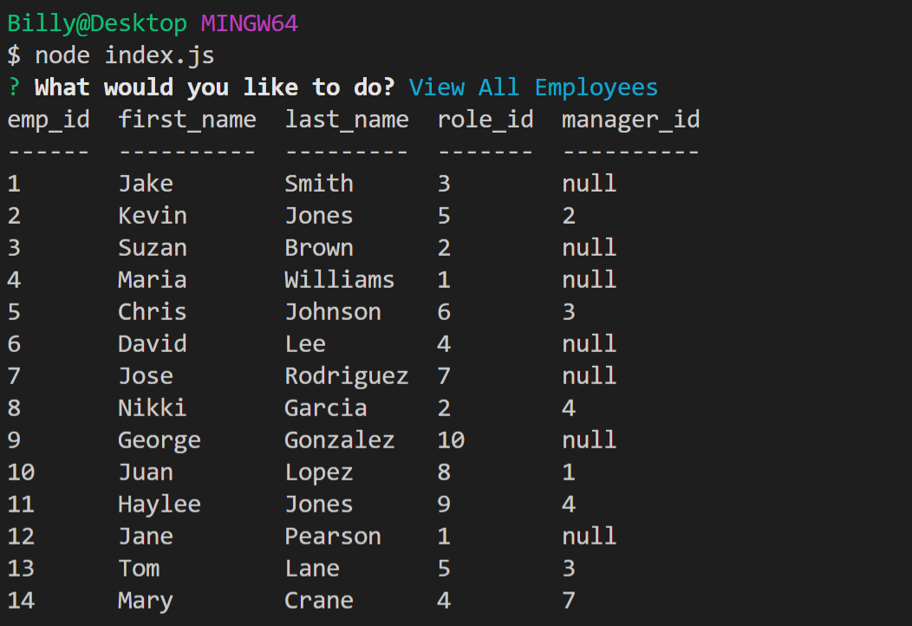
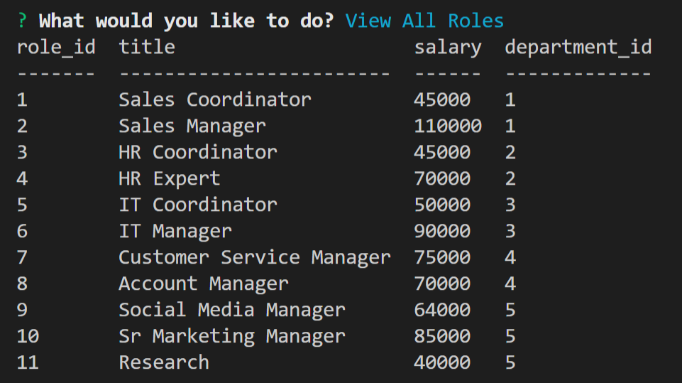
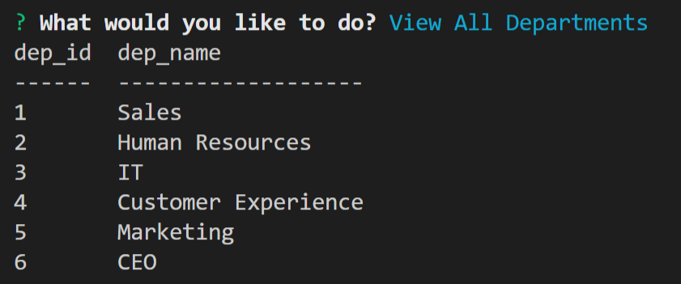
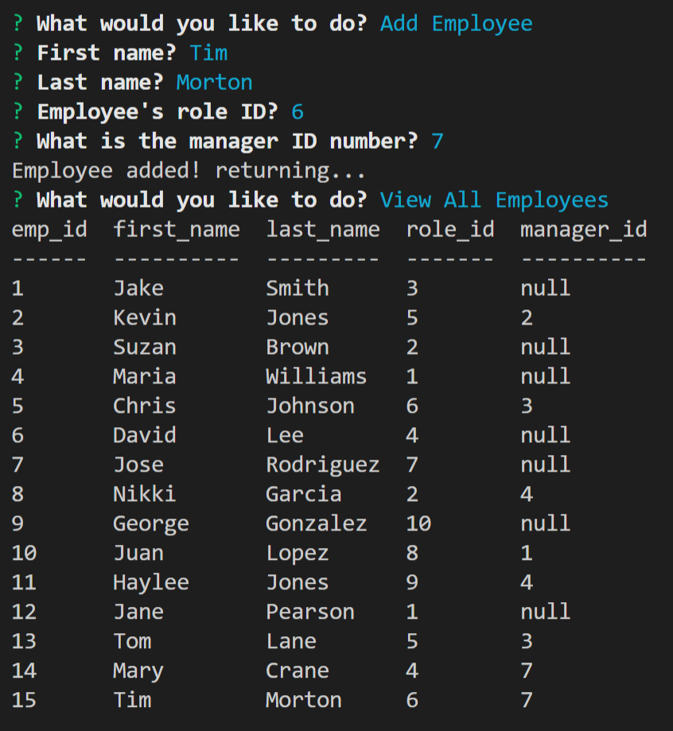
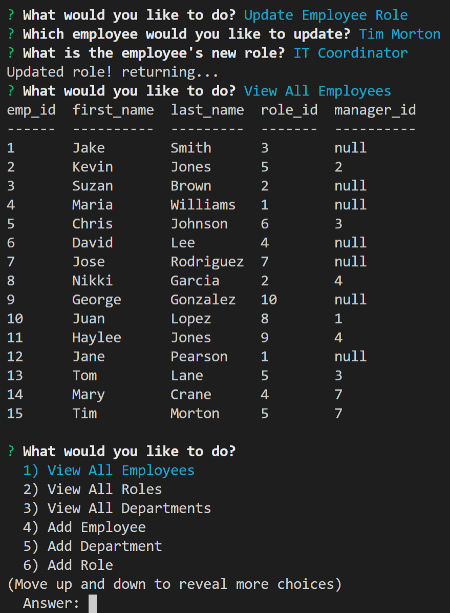

# Employee Tracker

  

  Developers are often tasked with creating interfaces that make it easy for non-developers to view and interact with information stored in databases. Often these interfaces are known as **C**ontent **M**anagement **S**ystems. In this application, I will architect and build a solution for managing a company's employees using node, inquirer, and MySQL. Upon executing ``` node index.js``` inside the terminal, the user will then be prompted with options to add, update, or view their employees and what their roles are.

  GitHub: https://github.com/WLeondike
  
  Watch the demo video here: <br>
  https://drive.google.com/file/d/16sYFtGisAzsli5xE81p-OlX5CnuJRc_I/view?usp=sharing
  

  ## Table of Contents
  <hr>

  * [Installation](#installation)
  * [Credits](#credits)
  * [License](#license)
  * [Screenshots](#screenshots)
  

  ## Installation
  <hr>
  
  > ``` npm i mysql ``` <br> ``` npm i inquirer ``` <br> ``` npm i console.table ```
  
  
  ## Credits
  <hr>
  
  John Dinsmore <br> Jorge Alvarez <br> W3 Schools <br> MDN Web docs <br> mySQL <br> inquirer <br> console.table <br> npm
  

  ## Screenshots
  <hr>
  
  <hr>
  
  <hr>
  
  <hr>
  
  <hr>
  
  <hr>


  ## License

  Permission is hereby granted, free of charge, to any person obtaining a copy of this software and associated documentation files (the "Software"), to deal in the Software without restriction, including without limitation the rights to use, copy, modify, merge, publish, distribute, sublicense, and/or sell copies of the Software, and to permit persons to whom the Software is furnished to do so, subject to the following conditions: <br> <br> The above copyright notice and this permission notice shall be included in all copies or substantial portions of the Software. <br> <br> THE SOFTWARE IS PROVIDED "AS IS", WITHOUT WARRANTY OF ANY KIND, EXPRESS OR IMPLIED, INCLUDING BUT NOT LIMITED TO THE WARRANTIES OF MERCHANTABILITY, FITNESS FOR A PARTICULAR PURPOSE AND NONINFRINGEMENT. IN NO EVENT SHALL THE AUTHORS OR COPYRIGHT HOLDERS BE LIABLE FOR ANY CLAIM, DAMAGES OR OTHER LIABILITY, WHETHER IN AN ACTION OF CONTRACT, TORT OR OTHERWISE, ARISING FROM OUT OF OR IN CONNECTION WITH THE SOFTWARE OR THE USE OR OTHER DEALINGS IN THE SOFTWARE.
